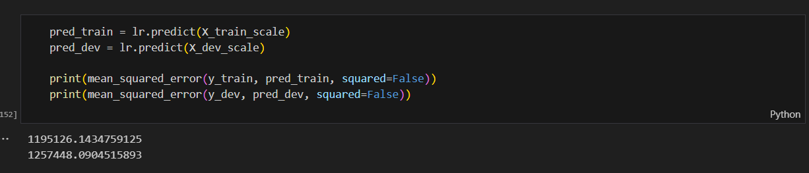

# Project 2: Bangkok Housing

## Business Problem Statement: Affordable Housing Access
According to property company (Land and House Co., Ltd.), The compapny would like to know the property price in each property type in Bangkok and around Bangkok (urban area such as Samut Prakan and Nonthaburi) to make further research and development in property that can help company to survey house pricing and will expand property in Bangkok.
- Company target market has many customer segmentation. Now the company estimate house pricing approximately 1.5 million to 3.5 million Thai Baht because nowdays, people are willing to save their money and utility cost is increased.
- Company is looking for property near station, for example, BTS, MRT, ART, and other skytrain stations.
- Where is the most price sensitivity? and where is the least?

## Data Dictionary
| Column Name | Data Type | Description |
|---|---|---|
| id | int | ID of selling item |
| province | string | Province name (Bangkok, Samut Prakan, or Nonthaburi) |
| district | string | District name |
| subdistrict | string | Subdistrict name |
| address | string | Address (e.g., street name, area name, soi number) |
| property_type | string | Type of the house (Condo, Townhouse, or Detached House) |
| total_units | float | Number of rooms/houses in the condo/village |
| bedrooms | int | Number of bedrooms |
| baths | int | Number of baths |
| floor_area | float | Total inside floor area (in square meters) |
| floor_level | int | Floor level of the room |
| land_area | float | Total land area (in square meters) |
| latitude | float | Latitude of the house |
| longitude | float | Longitude of the house |
| nearby_stations | int | Number of nearby stations (within 1km) |
| nearby_station_distance | list | List of (station name, distance) tuples |
| nearby_bus_stops | int | Number of nearby bus stops |
| nearby_supermarkets | int | Number of nearby supermarkets |
| nearby_shops | int | Number of nearby shops |
| year_built | int | Year built |
| month_built | string | Month built (January-December) |
| price | float | Selling price (target value) |

## Exploratory Data Analysis
### Identify Missing data

There are many missing data in this following:
1. total_units
2. subdistrict
3. bedrooms
4. baths
5. floor_level
6. land_area
7. nearby_station_distance
8. nearby_bus_stops
9. month_built

To impute a reasonable value is in this following methods:
1. Interpolate - to estimate intermediate values from a set of known data points. This method had been used in following missing data:
total_units, bedrooms, baths, floor_level, land_area

2. fillna `Unknown` to nearby_station_distance because may be some location of property are not near railway stations. Plus, I don't know what exactly those location near railway stations

3. Random in range (12-month) to month_built

4. Random Integer for floor_level which I set range 3-30 levels because I think most condominium are not higher than 32 levels

## Outliers

Calculate outliers by using IQR to know lower bound and upperbound. However, these data mostly upperbound. then, I remove outliers to make more accuracy on prediction model.

## Misleading Data
Importantly, I found there are wrong data on `subdistrict` column which are property name on this feature. Then I look district data which contains subdistrict data. After that, I replace correct subdistrict data from district data to fill the particular column.

## Distributions

## Correlations

# Pre-processing
## Possible Selected Features from correlation
1. subdistrict
2. property_type
3. bedrooms
4. baths
5. floor_area
6. floor_level
7. land_area
8. nearby_stations
9. nearby_supermarkets
10. nearby_shops
11. price (Key Feature)

## Modelling
### Linear Regression Model

I used `Linear Regression` from train/test split and extend ridge model to get more accurate

### Ridge Model
To compare with lasso and elasticnet, R2 ridge score is better than R2 lasso score about 10%. 

When I calculate by using root mean standard error(RMSE) score, it show below:

### Lasso Model
When I calculate by using root mean standard error(RMSE) score, it show below:

# Conclusions and Recommendations

The table above states that which feature (factor) inference with housing price prediction. The highest coefficient score is floor_area, followed by baths. These factors can help the company think about their pricing to segment the target. Then, the best house price prediction model is `Ridge` model which got root mean square error score: 1,245,066. Moreover, the `Lasso` model's root mean square is 1,250,707. These RMSE is a small different. To sum up with problem statement which will answer in this following:

1. Company target market has many customer segmentation. Now the company estimate house pricing approximately 1.5 million to 3.5 million Thai Baht because nowdays, people are willing to save their money and utility cost is increased.
- the property which is in Talat Khwan subdistrict, Nonthaburi province, the price is 1,500,000 Thai Baht.

2. Company is looking for property near station, for example, BTS, MRT, ART, and other skytrain stations.
- The cheapest price is approximate 1.5 million Thai Baht in Nonthaburi where near MRT: Ministry of Public Health Station

3.  Where is the most price sensitivity? and where is the least?
- the highest price sensitivity is in subdistrict: Klong Tan Nuea which coefficient score is 541173
- the lowest price sensitivity is in subdistrict: Bang Rak Phattana which coefficient score is -162237

Recommendations
1. Other features such as latitude and longitude can be effective to know exactly where the property is to help understanding for the company
2. May be use hyper parameter tuning in its model
3. Elastic Net model may give other result or better result than these two models to compare
